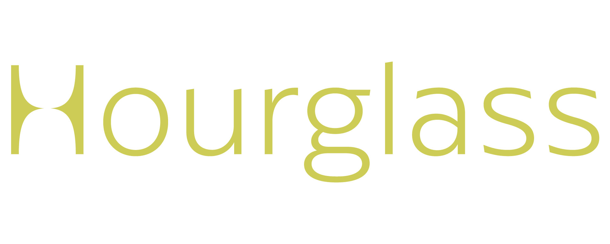
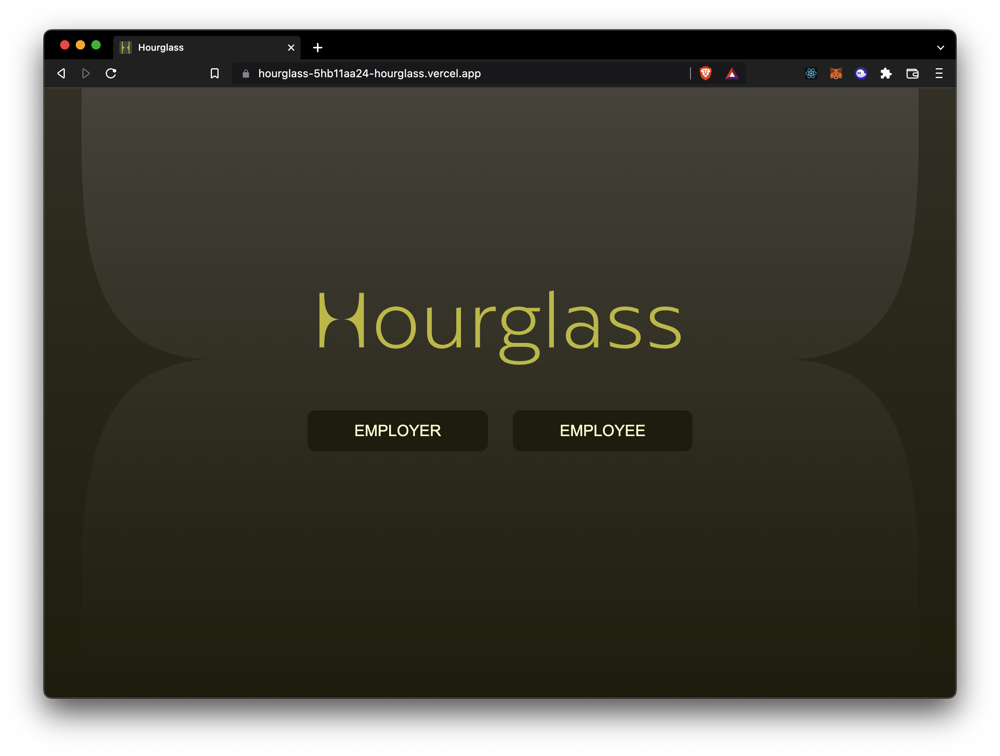
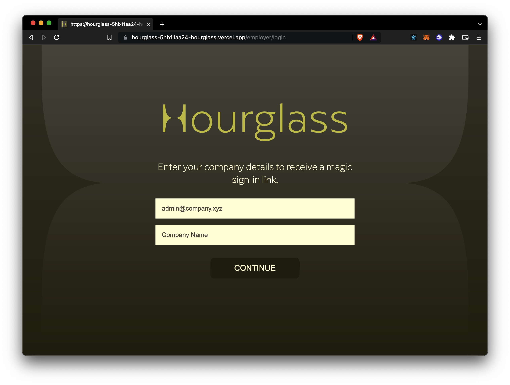
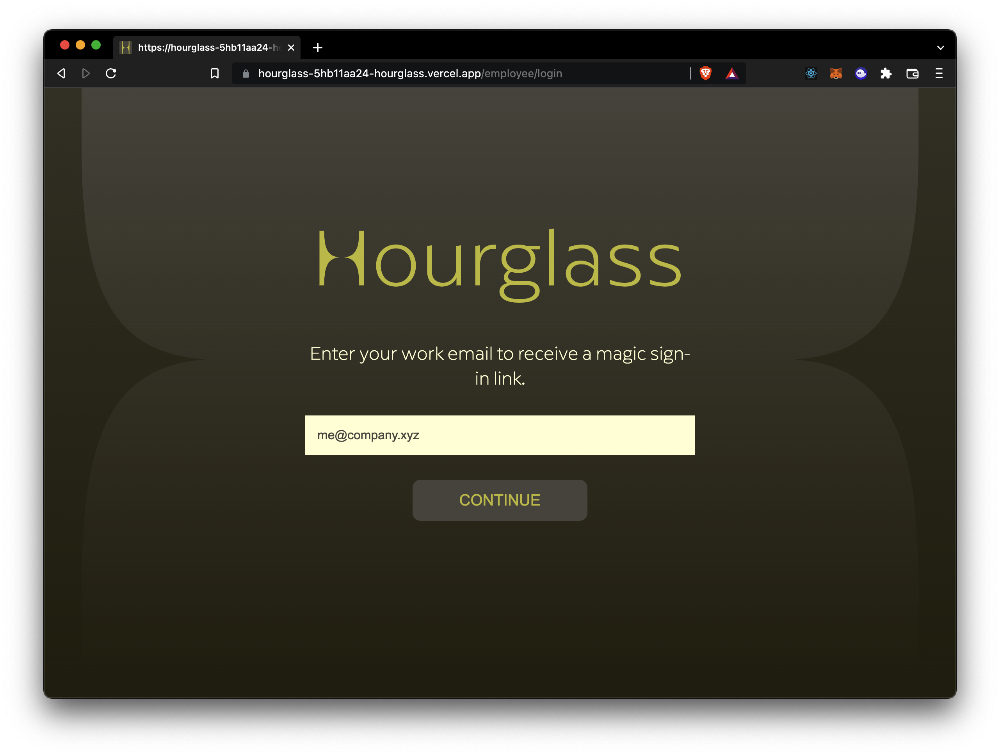
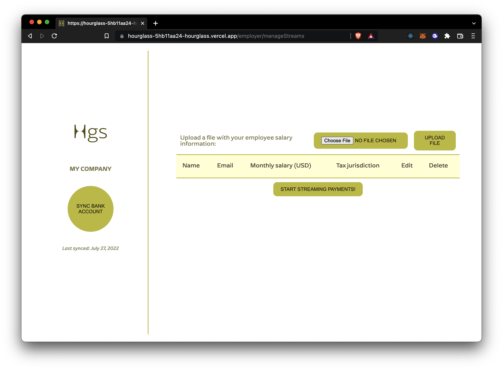
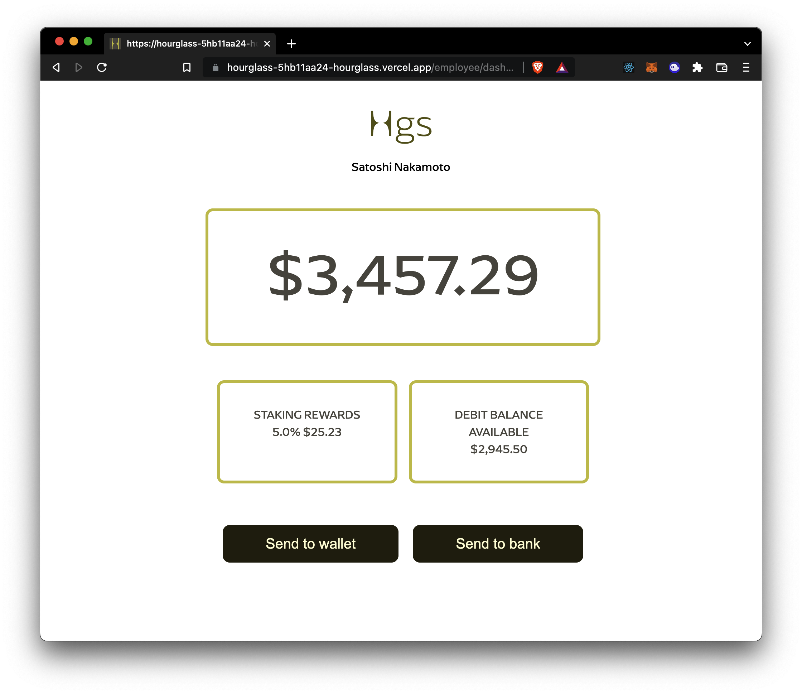

# Hourglass - [ETHMexico](https://mexico.ethglobal.com)

_By [devlyn37,](https://github.com/devlyn37) [eduairet,](https://github.com/eduairet) [nick-bash](https://github.com/nick-bash)_

### Have you ever imagined having your monthly income always available and growing in real-time?

**Hourglass** is an app that allows you as an employer to create payment streamings for your employees, thanks to the **power of [Superfluid](https://www.superfluid.finance/home)** we were able to mount a real-time payment tool that allows the employee **to see his money growing day by day,** and most importantly, **to have immediate access to it anytime, anywhere,** giving him the possibility of **claiming his funds or also earn interest while holding them** into the company's wallet **thanks to [AAVE.](https://aave.com)**

The prototype has a simple logic to follow:

- It has a landing page that redirects you to the employer or employee login pages.
  
  
  
- As an employer, you can manage your employees cashflow and make sure that they will always have their payments by a simple Bank Account Sync **(don't worry, we'll make crypto invisible and easy for you)**
  
- As an employee you'll have a dashboard where you'll be able to check your money growing all the time, take a look at your interest rewards and claim your funds, we don't want to scare non-crypto native folks, that's why by default you'll have your streaming connected to your bank account but you can always set your wallet.
  

Check the live prototype on [hourglass-5hb11aa24-hourglass.vercel.app](https://hourglass-5hb11aa24-hourglass.vercel.app)
